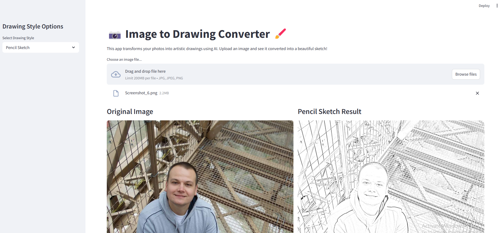

# Image to Drawing Converter

<div align="center">
  
  <br>
  <p><em>Transform your photos into artistic drawings using AI</em></p>
</div>

A Streamlit application that converts images into artistic drawings using computer vision techniques.

## Features
- ✏️ Convert images to pencil sketches
- 🖋️ Convert images to pen sketches
- 💾 Download converted images
- 🎨 User-friendly web interface

## Quick Start

### Using Docker

1. Pull the image:
```bash
docker pull your-dockerhub-username/image-to-drawing:latest
```

2. Run the container:
```bash
docker run -p 5000:5000 your-dockerhub-username/image-to-drawing:latest
```

The application will be available at `http://localhost:5000`

## Docker Instructions

### Prerequisites
- Docker installed on your system
- Docker Hub account (for pushing images)

### Building the Docker Image

1. Build the image locally:
```bash
docker build -t your-dockerhub-username/image-to-drawing:latest .
```

### Pushing to Docker Hub

1. Login to Docker Hub:
```bash
docker login
```

2. Push the image to Docker Hub:
```bash
docker push your-dockerhub-username/image-to-drawing:latest
```

### Additional Docker Commands

- View running containers:
```bash
docker ps
```

- Stop the container:
```bash
docker stop <container_id>
```

- Remove the container:
```bash
docker rm <container_id>
```

- Remove the image:
```bash
docker rmi your-dockerhub-username/image-to-drawing:latest
```

## Requirements
- Python 3.10.11
- OpenCV
- Streamlit
- NumPy
- Pillow
- Requests

All dependencies are automatically installed in the Docker container.

## License
This project is open source and available under the MIT License. 